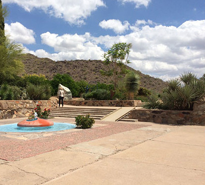
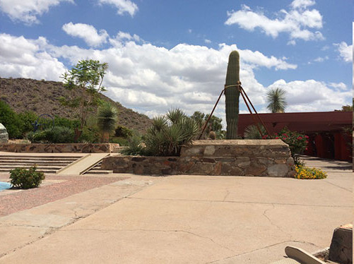
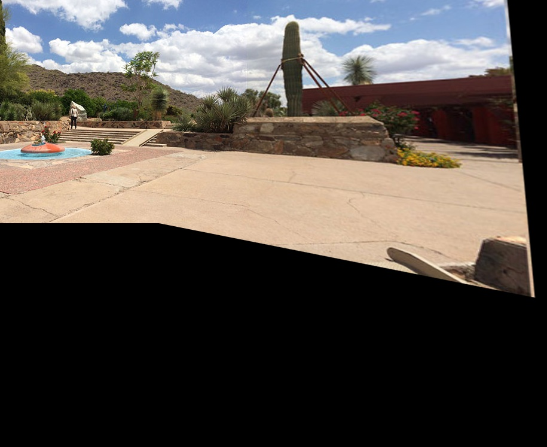

# Panorama 
Panorama image stitching is application of homography transformation over an image.  
Conditions for homography:
1) camera projection center should be rotated about its axis no translation should take place.
2) There must be a sufficient amount of overlapping area to estimate correspondence.  

## How to use 
`git clone https://github.com/pareespathak/panorama.git`  
`pip3 install -r requirements.txt`  
`python basic_panorama.py`
# Pipeline 
## Finding image overlap 
1) Take image pairs from a calibrated camera keeping the camera location constant and perform lens distortion and rectification.
2) Find keypoints in image pairs using SIFT(scale invariant feature transform).
3) Find the correspondence using FLANN (Fast library for approximate nearest neighbours).
4) Apply the Lowe ratio test for selecting best matches.
5) Find Homography Matrix from the correspondence and extract translation information.
## Stiching 
1) Keep the first image as a reference frame and extract the transformation matrix for the second image.
2) Create a resulting image which can hold both the images.
3) Wrap the second image in the resulting image and add the first image to this construction.  
Reference code : [Panorama](https://github.com/pareespathak/panorama/blob/main/basic_panorama.py) 
## Results:
 |  
-----------------------------------------|------------------------------------------
Stitching of two images:  

Results
